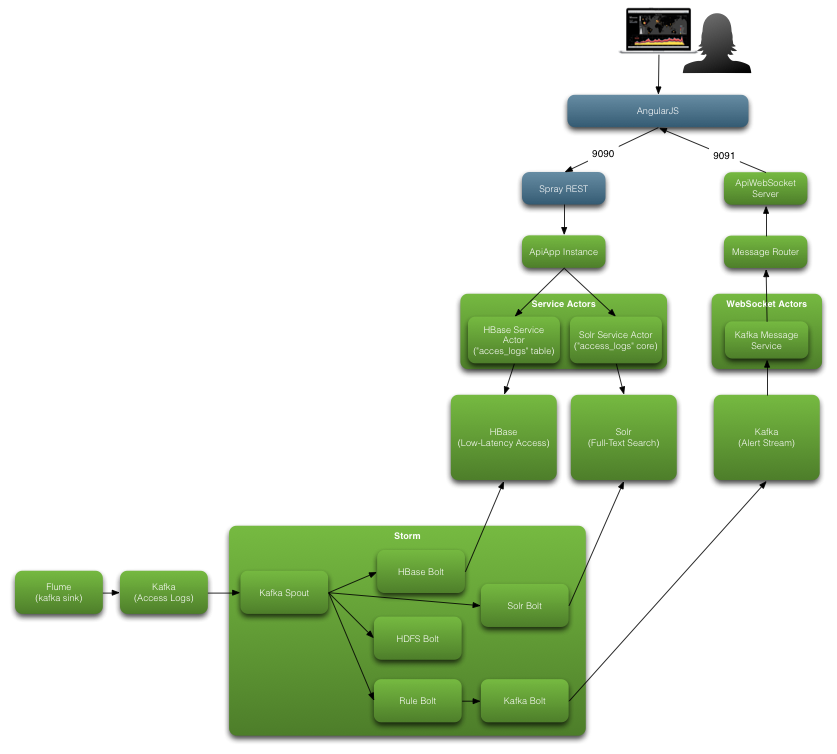

# Overview

This Assembly focusses on the following HDP Components:

 * Flume for remote log collection
 * Kafka for event queueing
 * Storm for event processing
  * Storm Kafka integration for Spout implementations
  * Storm HBase Bolt for event persistence
  * Storm HDFS Bolt for event persistence
  * Custom Storm Solr bolt for event persistence
  * Custom Rule Bolt for detection of 404 events and emitting new alerts
  * Storm Kafka Bolt to push alert's to downstream consumers
 * Assembly UI to Search Solr, Retrieve/Scan HBase, and display Kafka based alerts

See the architectural overview below.

# Architecture

# Log Management Assembly Setup

## Assumptions

You have git, maven, npm, sbt, ant, and Java installed.  You have a sane PATH and JAVA_HOME.

## Project Checkout

Checkout the assembly project components:

 * Assembly UI
 * Log Management Project

We'll do that using Git;

    mkdir /opt/assemblies
	git clone https://github.com/hortonworks/coe-int.git

Pull down and build the relevent projects

### Assembly UI

	cd /opt/assemblies/coe-int/assembly-ui/src/main/webapp
	npm install
	cd /opt/assemblies/coe-int/assembly-ui/
	sbt run

### Log Management Assembly

	cd /opt/assemblies/coe-int/assemblies/log_management/
	mvn clean package

# Configure Flume

Move assets to flume plugins

	$ su
	# export FLUME_HOME=/usr/hdp/current/flume-server
	# mkdir -p $FLUME_HOME/plugins.d/kafka-sink/lib
	# mkdir -p $FLUME_HOME/plugins.d/kafka-sink/libext
	# unzip $ASSEMBLY_HOME/packages/flume-kafka-sink-dist-0.5.0-bin.zip $FLUME_HOME/plugins.d/kafka-sink
	# cp $ASSEMBLY_HOME/kafka/target/log-management-kafka-1.0-SNAPSHOT.jar $FLUME_HOME/plugins.d/kafka-sink/lib
	# cp /usr/hdp/current/kafka-broker/libs/kafka_2.10-0.8.1.2.2.0.0-2041.jar $FLUME_HOME/plugins.d/kafka-sink/libext
	# cp /usr/hdp/current/kafka-broker/libs/metrics-core-2.2.0.jar $FLUME_HOME/plugins.d/kafka-sink/libext
	# cp /usr/hdp/current/kafka-broker/libs/scala-library-2.10.4.jar $FLUME_HOME/plugins.d/kafka-sink/libext

Verify that all jar's are where they should be:

	# find $FLUME_HOME/plugins.d/kafka-sink
	/usr/hdp/current/flume-server/plugins.d/kafka-sink
	/usr/hdp/current/flume-server/plugins.d/kafka-sink/lib
	/usr/hdp/current/flume-server/plugins.d/kafka-sink/lib/flume-kafka-sink-dist-0.5.0-bin.zip
	/usr/hdp/current/flume-server/plugins.d/kafka-sink/lib/log-management-kafka-1.0-SNAPSHOT.jar
	/usr/hdp/current/flume-server/plugins.d/kafka-sink/libext
	/usr/hdp/current/flume-server/plugins.d/kafka-sink/libext/kafka_2.10-0.8.1.2.2.0.0-2041.jar
	/usr/hdp/current/flume-server/plugins.d/kafka-sink/libext/scala-library-2.10.4.jar
	/usr/hdp/current/flume-server/plugins.d/kafka-sink/libext/metrics-core-2.2.0.jar

## Flume Agent Configuration

	# Sources, channels, and Sinks
	agent.sources = accessLogsSrc
	agent.channels = accessLogsChannel
	agent.sinks = kafkaSink

	# For each one of the sources, the type is defined
	agent.sources.accessLogsSrc.type = exec
	agent.sources.accessLogsSrc.command = tail -F /var/log/httpd/access_log
	#agent.sources.accessLogsSrc.batchSize = 20

	# Each sink's type must be defined
	agent.sinks.kafkaSink.type = com.thilinamb.flume.sink.KafkaSink
	agent.sinks.kafkaSink.topic = access_logs
	agent.sinks.kafkaSink.preprocessor =  com.hortonworks.demo.AccessLogMessageProcessor
	agent.sinks.kafkaSink.kafka.metadata.broker.list = bimota.hortonworks.local:6667
	agent.sinks.kafkaSink.kafka.serializer.class = kafka.serializer.StringEncoder
	agent.sinks.kafkaSink.kafka.request.required.acks = 1

	# Each channel's type is defined.
	agent.channels.accessLogsChannel.type = file
	agent.channels.accessLogsChannel.checkpointDir = /opt/assemblies/log_management/state/flume/checkpoints
	agent.channels.accessLogsChannel.dataDirs = /opt/assemblies/log_management/state/flume/data
	agent.channels.accessLogsChannel.capacity = 1000000
	agent.channels.accessLogsChannel.transactionCapacity = 1000000

	#  Connect the source and sink via the channel
	agent.sources.accessLogsSrc.channels = accessLogsChannel
	agent.sinks.kafkaSink.channel = accessLogsChannel

Allow the unprivileged user to access the Apache logs

	# chown :users /var/log/httpd/
	# chmod g+rx /var/log/httpd/
	# flume-ng agent -n agent -c /etc/flume/conf -f agent.conf -Dflume.root.logger=DEBUG,console

# Configure Kafka

Create the `access_logs` topic

	# cd /usr/hdp/2.2.0.0-2041/kafka/bin
	# ./kafka-topics.sh --create --zookeeper bimota.hortonworks.local:2181 --replication-factor 1 --partitions 1 --topic access_logs
	# ./kafka-topics.sh --create --zookeeper bimota.hortonworks.local:2181 --replication-factor 1 --partitions 1 --topic access_logs_errors
	# ./kafka-topics.sh --list --zookeeper bimota.hortonworks.local:2181

# Configure HBase

	hbase shell
	hbase> create 'access_logs', 'request'

# Configure Solr

Create the solr user and add a password

    # adduser solr
    # passwd solr

Create a location for the installation

    # mkdir /opt/solr
    # chown solr:solr /opt/solr

### Download and Install

SU to the solr user

    # su solr
    $ cd /opt/solr

Download Solr from http://lucene.apache.org/solr/downloads.html

    $ wget http://archive.apache.org/dist/lucene/solr/4.7.2/solr-4.7.2.zip
    
Download Banana from Github

    $ wget https://github.com/LucidWorks/banana/archive/banana-1.2.tar.gz
    
Untar Solr and Banana

    $ unzip solr-4.7.2.zip
    $ tar -zxvf /opt/solr/banana-1.2.tar.gz
    $ cd banana-banana-1.2/    

Build Banana

    $ mkdir build
    $ ant

Deploy Banana    

    $ cp -r solr-4.5.0/kibana-int ../solr-4.7.2/example/solr/
    $ cp build/banana*.war ../solr-4.7.2/example/webapps/banana.war
    $ cd ../solr-4.7.2/example

Create a new context file here `/opt/solr/solr-4.7.2/example/contexts/banana-context.xml` and add the following contents:

    <?xml version="1.0"?>
    <!DOCTYPE Configure PUBLIC "-//Jetty//Configure//EN" "http://www.eclipse.org/jetty/configure.dtd">
    <Configure class="org.eclipse.jetty.webapp.WebAppContext">
      <Set name="contextPath"><SystemProperty name="hostContext" default="/banana"/></Set>
      <Set name="war"><SystemProperty name="jetty.home"/>/webapps/banana.war</Set>
      <Set name="tempDirectory"><Property name="jetty.home" default="."/>/banana-webapp</Set>
    </Configure>

Start Solr

    $ java -jar start.jar

Solr should now be deployed and started, validate that by navigating to http://your.host.com:8983/solr.  The next step is to focus on creating the "kibana-int" core, after which we'll ingest some data into.  This core is used to save stored Banana dashboards and is optional, but recommended.

 * Click on *Core Admin* from the left-side menu
 * Click on the *Add Core* button
 * Fill in the form with the following data

<table style="border: 1px solid black">
    <tr><td><strong>name</strong></td><td>kibana-int</td></tr>
    <tr><td><strong>instanceDir</strong></td><td>/opt/solr/solr-4.7.2/example/solr/kibana-int</td></tr>
    <tr><td><strong>dataDir</strong></td><td>data</td></tr>
    <tr><td><strong>config</strong></td><td>solrconfig.xml</td></tr>
    <tr><td><strong>schema</strong></td><td>schema.xml</td></tr>
</table>

 * Click on the *Add Core* button

Now, add the Apache Access Logs core once you've created the directory and put in the starting solrconfig.xml, and schema.xml (found in ./solr/schema.xml of this project).

    $ mkdir /opt/solr/solr-4.7.2/example/solr/access_logs
    $ cp -ra /opt/solr/solr-4.7.2/example/solr/collection1/conf /opt/solr/solr-4.7.2/example/solr/access_logs/conf
    $ cp $THIS_PROJECT_PATH/solr/schema.xml /opt/solr/solr-4.7.2/example/solr/access_logs/conf
    $ cd /opt/solr/solr-4.7.2/example
    $ java -jar start.jar

Now from the Solr Admin UI:

 * Click on *Core Admin* from the left-side menu
 * Click on the *Add Core* button
 * Fill in the form with the following data

<table style="border: 1px solid black">
    <tr><td><strong>name</strong></td><td>access_logs</td></tr>
    <tr><td><strong>instanceDir</strong></td><td>/opt/solr/solr-4.7.2/example/solr/access_logs</td></tr>
    <tr><td><strong>dataDir</strong></td><td>data</td></tr>
    <tr><td><strong>config</strong></td><td>solrconfig.xml</td></tr>
    <tr><td><strong>schema</strong></td><td>schema.xml</td></tr>
</table>

 * Click on the *Add Core* button

# Demo Runthrough

## Show Access Logs (Terminal 1)

	$ ls -l /var/log/httpd/access_log
	$ tail -F /var/log/httpd/access_log

## Show the topic that was created (Terminal 1)

	$ cd /usr/hdp/2.2.0.0-2041/kafka/bin
	$ ./kafka-topics.sh --list --zookeeper bimota.hortonworks.local:2181

## Run Flume Agent (Terminal 1)

	$ cd /opt/assemblies/log_management/conf/flume
	$ flume-ng agent -n agent -c /etc/flume/conf -f /opt/assemblies/log_management/conf/flume/agent.conf -Dflume.root.logger=DEBUG,console

## Consume events using console consumer (Terminal 2)

	cd /usr/hdp/2.2.0.0-2041/kafka/bin
	./kafka-console-consumer.sh --zookeeper bimota.hortonworks.local:2181 --from-beginning --topic access_logs

## HDFS Path (Terminal 2)

	hadoop fs -ls /data/access_logs

## HBase Table (Terminal 2)

	describe 'access_logs'

## Solr Core (Terminal 2)

Navigate to `http://bimota.hortonworks.local:8983/solr/#/access_logs`

## Submit storm topology (Terminal 2)

	cd /opt/assemblies/log_management
	storm jar storm-1.0-SNAPSHOT.jar com.hortonworks.demo.topologies.AccessLogTopology /opt/assemblies/log_management/conf/storm/config.properties

## Create Hive Table (Terminal 2)

	$ hive
	hive> create external table access_logs(
	  rowKey string,
	  remoteAddr string,
	  remoteLogname string,
	  user string,
	  time string,
	  request string,
	  status string,
	  bytes_string string,
	  referrer string,
	  browser string
	)
	ROW FORMAT DELIMITED
	  FIELDS TERMINATED BY '|'
	STORED AS TEXTFILE
	LOCATION '/data/access_logs/raw';

## Select From Hive Table (Terminal 2)

	set hive.execution.engine=tez;
	select * from access_logs limit 10;

# Cleanup

Delete Solr Documents from the `access_logs` core

	curl -i 'http://bimota.hortonworks.local:8983/solr/access_logs/update?stream.body=<delete><query>id:*</query></delete>&commit=true'

Delete HDFS data:

	hadoop fs -rm /data/access_logs/raw/*
	hadoop fs -rm /data/access_logs/staging/*

Truncate HBase Table

	hbase shell
	hbase> truncate 'access_logs'

# Appendix

## Building the flume-ng-kafka-sink

Checkout and build the `flume-ng-kafka-sink`.

	$ git clone https://github.com/thilinamb/flume-ng-kafka-sink.git
	$ cd flume-ng-kafka-sink
	$ mvn clean install	

Move assets to flume plugins

	$ su
	# export FLUME_HOME=/usr/hdp/current/flume-server
	# mkdir -p $FLUME_HOME/plugins.d/kafka-sink/lib
	# mkdir -p $FLUME_HOME/plugins.d/kafka-sink/libext
	# unzip dist/target/flume-kafka-sink-dist-0.5.0-bin.zip $FLUME_HOME/plugins.d/kafka-sink
	# cp example/target/flume-kafka-sink-example-0.5.0.jar $FLUME_HOME/plugins.d/kafka-sink/lib
	# cp /usr/hdp/current/kafka-broker/libs/kafka_2.10-0.8.1.2.2.0.0-2041.jar $FLUME_HOME/plugins.d/kafka-sink/libext
	# cp /usr/hdp/current/kafka-broker/libs/metrics-core-2.2.0.jar $FLUME_HOME/plugins.d/kafka-sink/libext
	# cp /usr/hdp/current/kafka-broker/libs/scala-library-2.10.4.jar $FLUME_HOME/plugins.d/kafka-sink/libext