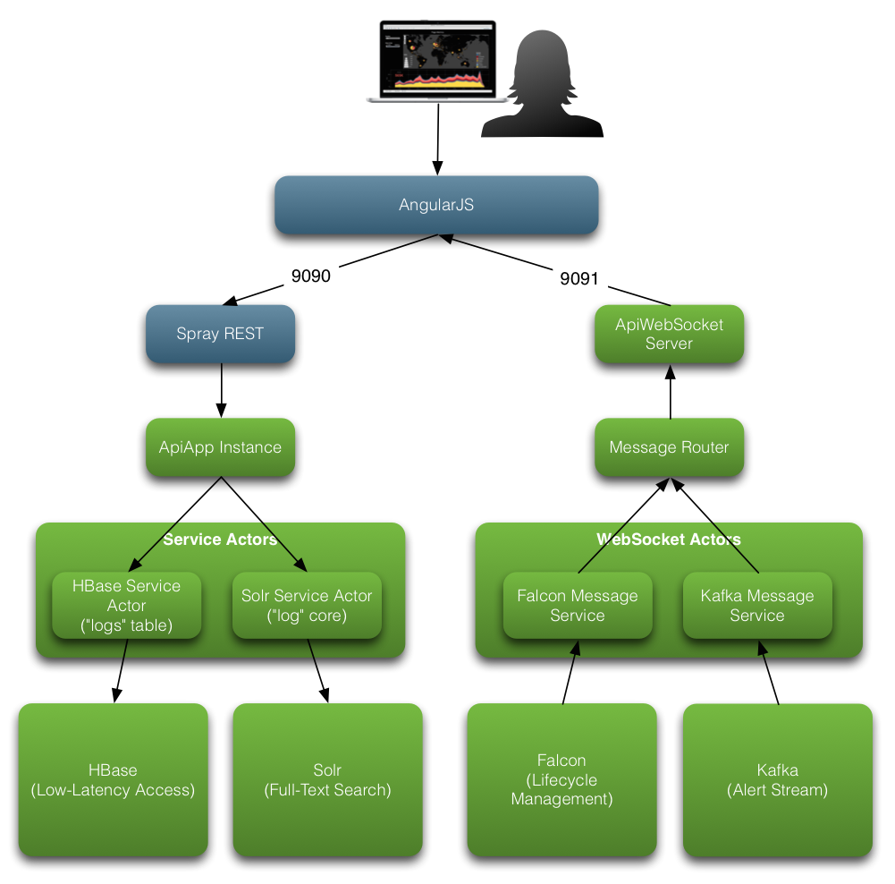

# Hortonworks Assembly UI

This project is meant to be a baseline starting point for creating interactive web applications that use HDP components.  It's been created to allow users to quickly create a UI for demo purposes without having to write a large amount of boilerplate integration code.  The project is written in Scala for the core components and JavaScript for the UI.  It is split into two components, the [Scala](http://www.scala-lang.org) Core API components and the [AngularJS](https://angularjs.org) web components.

To get started, review the documentation below, implement your own class that extends `ApiApp` and update the UI to suit your needs.

**Core API Components (HTTP-related):**
`src/main/scala/com/hortonworks/demo/framework/api`

**Core Service Components (Hadoop Client-related):**
`src/main/scala/com/hortonworks/demo/framework/services`

**AngularJS Web Components:**
`src/main/webapp`

## Architecture

[Spray](http://spray.io) is used to construct a RESTful HTTP layer on top of a group of [Akka](http://akka.io) actors.  There will be an actor for each of the HDP client components, but for now the following have base implementations:

 * Solr
 * HBase
 
These were started with as they are most commonly used with interactive web applications, and as such are the best candidates for exposing via this custom web UI.  More will be implemented as time allows.

AngularJS is used as the browser-based MVC framework and allows for rapid development, an easy to use abstraction, and built in handling of REST requests using the [$resource](https://docs.angularjs.org/api/ngResource/service/$resource) component.

The diagram below shows the overall architecture of the project.



The `ApiApp` mentioned above is the main entry point for your custom application.  This is where you define your own class that extends ApiApp and includes the actors that you'd like to have an API instantiated for.

```scala
package com.hortonworks.apps

import com.hortonworks.demo.framework.api.ApiApp
import com.hortonworks.demo.framework.api.websocket.Broadcast

object LogManagementApplication extends ApiApp {
  addSolrActor("access_logs")
  addHbaseActor("logs")
  startServer

  var increment = 0
  while (true) {
    increment += 1
    system.actorSelection("user/messageRouter") ! Broadcast(increment.toString)
    Thread.sleep(5000)
  }
}
```

In the example above, we're creating our main LogManagementApplication entry point, and defining a Solr Actor for the "access_logs" core, and an HBase Actor for the "logs" table.  Once those actors have been added, we're creating a simple loop that shows how to create a message and push it to the browser using WebSocket.  In this case we're just pushing incremental messages to the UI using the `Broadcast` case class and sending it as a message to the `messageRouter` actor looked up using `system.actorSelection`.

Running this with `sbt ~re-start` will tell Spray to bind on tcp/9090 for the main Web UI and tcp/9091 for WebSocket.

Once started, you can hit the UI using http://localhost:9090.  The specific API's that have been added as part of `addSolrActor(...)` and `addHbaseActor(...)` are available here:

* **Solr**: http://localhost:9090/hbase/logs/scan?startRow=219.143.38.232
* **HBase**: http://localhost:9090/solr/access_logs/search?query=remoteAddr:219.143.38.232

To see the specific paths that are exposed for each table and core see the constructRoutesFromApiClasses method in `src/main/scala...CoreHttpServiceActor.scala`.  Currently the following operations are implemented:

**HBase**

 * Get - /hbase/<table name>/get?rowKey=<your rowkey>
 * Scan - /hbase/<table name>/scan?startRow=<your start>&endRow=<your end>
     

**Solr**

 * Simple Query - /solr/<your core>/search?query=<field>:<query>
 * Query with Facet - /solr/<your core>/search?query=<field>:<query>&facet.field=<your facet field>


## PreReq's

 * `sbt` - Scala Build Tool
 * `npm` - Node Package Manager

## Installing dependencies (Node, and Bower Components)

     cd src/main/webapp
     npm install
     
## Import into Eclipse

    sbt eclipse

Import into Eclipse as "Existing Project"

# Extending This Project

### Dependencies

#### Java Dependencies

Include your dependencies using sbt by adding the pom equivalent dependencies to `build.sbt`.  The Hortonworks repositories are already added, so just add your group, artifact, and version specifications.

    "org.apache.hbase"	 %	  "hbase-client"  % "0.98.0.2.1.1.0-385-hadoop2"
    
To make sure everything gets pulled down the way you want it to, then run `sbt compile`, or `sbt eclipse` to pull them into your eclipse project.

#### AngularJS Dependencies
    
If you want to add dependencies to Angular, just update the `src/main/webapp/bower.json` with the added dependency.

    "angular-leaflet-directive": "~0.7.8"

To pull it down, add it to `src/main/webapp/apps/bower_components` then tell npm to install it for you.

    npm install
    
Once a bower component has been installed, it needs to be included in `src/main/webapp/app/index.html`

```javascript
<script src='/bower_components/angular-leaflet-directive/dist/angular-leaflet-directive.min.js'></script>
```
Lastly, the component needs to be added to your AngularJS application through `src/main/webapp/app/js/app.js`.  See the below example where 'leaflet-directive' has been added.

```javascript
angular.module('myApp', [
  ...,
  'leaflet-directive'
])
```
    
### Adding Hadoop Client Services

Hadoop client services are implemented as Akka actors written in Scala.  Each Service has an actor implementation, as well as a Writer class.  The actor implementation encapsulates all of the functionality to invoke the Hadoop client, and the writer helps marshal the results of those client operations into JSON to be exposed through Spray to AngularJS as a `Service` object that wraps a `$resource`.  We'll start by creating the service actor.

```scala
package com.hortonworks.demo.framework.services

import org.apache.hadoop.conf.Configuration
import org.apache.hadoop.hbase.client.HConnection
import com.hortonworks.demo.framework.api.ApiActor
import akka.actor.Actor
import akka.actor.Props
import akka.actor.actorRef2Scala
import org.apache.hadoop.hbase.client.HBaseAdmin
import com.hortonworks.demo.framework.api.ApiConfiguration
import org.apache.hadoop.hbase.util.Bytes
import org.apache.hadoop.hbase.HBaseConfiguration
import org.apache.hadoop.hbase.client.HTableInterface
import org.apache.hadoop.hbase.client.Put
import org.apache.hadoop.hbase.client.HConnectionManager
import org.apache.hadoop.hbase.client.Result
import org.apache.hadoop.hbase.client.Get
import spray.httpx.SprayJsonSupport._
import spray.json._
import spray.json.DefaultJsonProtocol._
import org.apache.hadoop.hbase.client.Scan
import scala.collection.JavaConversions._
import akka.actor.ActorLogging

// Object used to hold static fields and define Props used for object instantiation through Akka
object SampleHbaseServiceActor {
  // These are the property objects that are used to construct actors.  Think of them like constructors, they take in instance
  // specific info passed during object creation.
  def props(table: String): Props = Props(new HbaseServiceActor(table))
  def props(table: String, typeMap: Map[String, String]): Props = Props(new HbaseServiceActor(table, typeMap))

  // Defines the prefix that will be used to reference these actors later using system.actorSelection("hbase-<yourtable>")
  val ActorNamePrefix: String = "hbase-"
}

// Class used to define methods that will be invoked by the API
class SampleHbaseServiceActor extends Actor with ApiActor with ActorLogging {
  var connection: HConnection = null
  val config: Configuration = HBaseConfiguration.create()
  var tableInterface: HTableInterface = null
  var typeMap: Map[String, String] = Map()

  // Constructor that takes in the table name that this actor will manage
  def this(table: String) = {
    this()
    // The ApiConfiguration object allows you to pull config settings from src/main/resources/application.conf
    config.set("hbase.zookeeper.quorum", ApiConfiguration.getConfig.getString("app.hbase.zk-quorum"))
    config.set("zookeeper.znode.parent", ApiConfiguration.getConfig.getString("app.hbase.zk-znode-parent"))
    HBaseAdmin.checkHBaseAvailable(config)
    connection = HConnectionManager.createConnection(config);
    tableInterface = connection.getTable(Bytes.toBytes(table))
  }

  // Constructor that takes in the table name and the map of how values should be cast (Long, String, etc)
  def this(table: String, typeMap: Map[String, String]) {
    this(table)
    this.typeMap = typeMap
  }

  def getActorNamePrefix: String = { HbaseServiceActor.ActorNamePrefix }

  // Get a row by key and return an optional result if it's found
  def get(key: String): Option[Result] = {
    val result: Result = tableInterface.get(new Get(Bytes.toBytes(key)))
    if (result != null)
      return Some(result)
    else
      return None
  }

  // Scan HBase for a set of optional Results if any are found
  def scan(startRow: String, stopRow: String): Option[Array[Result]] = {
    log.info("Starting Scan with startRow: " + startRow + " and stopRow: " + stopRow)
    val scan: Scan = new Scan()
    if (startRow != null) scan.setStartRow(Bytes.toBytes(startRow))
    if (stopRow != null) scan.setStopRow(Bytes.toBytes(stopRow))
    val scanResults = tableInterface.getScanner(scan)
    if (scanResults != null)
      return Some(scanResults.iterator().toArray)
    else
      return None
  }

  // Not implemented yet - you want to do it?
  def put(key: String, cf: String, qual: String, value: String): Unit = {
    val put: Put = new Put(key.getBytes());
    Bytes.toBytes("")
    put.add(cf.getBytes(), qual.getBytes(), value.getBytes());
    tableInterface.put(put);
  }

  // This method is invoked by all Akka actors that send this object a message.  The messages are defined as CaseClasses below.
  def receive() = {
    case GetRow(rowKey) => sender() ! {
      get(rowKey) match {
        // Get a result and use the HbaseServiceRowWriter class to marshall this to JSON
        case Some(result) => { result.toJson(new HbaseServiceRowWriter(typeMap)).toString }
        case None => { "" }
      }
    }
    case ScanTable(startRow, stopRow) => sender() ! {
      scan(startRow, stopRow) match {
        case Some(results) => { results.toJson(new HbaseServiceScanWriter(typeMap)).toString }
        case None => ""
      }
    }
  }
}

// Case Classes used as messages to be passed from other actors to this actor
case class GetRow(rowKey: String)
case class ScanTable(startRow: String, stopRow: String)
```

Once you have defined an `ApiActor` and a class that extends `JsonWriter` to help marshall the results, you can hook it up to the API to expose it using HTTP.  The first thing to do is add some helper method to allow people to easily add an actor.  For that we'll go to the `Api` trait.  We can use the `addApiActor` method to add an actor to the system.  In order to use this, you need to define a constant in the `ApiType` Enumeration:

```scala
object ApiType extends Enumeration {
  val Solr = Value
  val HBase = Value
}
```

Once the constant has been added, we can add the component-specific methods:

```scala
def addHbaseActor(table: String): Unit = {
  val name = HbaseServiceActor.ActorNamePrefix + table
  addApiActor(ApiType.HBase, system.actorOf(HbaseServiceActor.props(table), name), name)
}

def addHbaseActor(table: String, typeMap: Map[String, String]) {
  val name = HbaseServiceActor.ActorNamePrefix + table
  addApiActor(ApiType.HBase, system.actorOf(HbaseServiceActor.props(table, typeMap), name), name)
}
```

The name here is important as it will be used to look this actor up from other components in the system.  That's why we define the constant in our Service Object.

```scala
val ActorNamePrefix: String = "hbase-"
```

At this point we have our service actor, our writer, our enumeration for the component type, and our helper methods to get the actor added to the system.  Now we need to setup some REST endpoints to expose it via HTTP.  For this we'll use the `CoreHttpServiceActor`.  In the `constructRoutesFromApiClasses` method we have a loop that runs through every actor that has been added via the `addApiActor` method, and based on the type of actor (from the `ApiType` Enumeration) will setup the appropriate routes.  We do this because you could have multiple HBase tables, or Solr cores that you want actors for.  The paths should be roughly the same, but they should have instance specific path names for the different tables in HBase, or cores in Solr.

The `constructRoutesFromApiClasses` method needs to have a check for the `ApiType.HBase` value as follows:

```scala
def constructRoutesFromApiClasses(routes: Route): Route = {
    implicit val timeout = Timeout(10 seconds)
    var newRoutes = routes
    for (apiType <- apiActors.keys) {
      apiActors.get(apiType) match {
        case Some(name) => {
        if (apiType == ApiType.HBase) {
            val tableName = name.split(HbaseServiceActor.ActorNamePrefix)(1)
            newRoutes = newRoutes ~
              pathPrefix("hbase") {
                pathPrefix(tableName) {
                  // Define your global HBase path handlers here
                  path("get") {
                    get {
                      parameters("rowKey") { (rowKey) =>
                        complete {
                          def getRow = {
                            val request = actorRefFactory.actorSelection("../" + name) ? GetRow(rowKey)
                            Await.result(request, timeout.duration).asInstanceOf[String]
                          }
                          getRow
                        }
                      }
                    }
                  } ~
                  path("scan") {
                    get {
                      parameters("startRow" ? "", "endRow" ? "") { (startRow,endRow) =>
                        complete {
                          val request = actorRefFactory.actorSelection("../" + name) ? ScanTable(startRow, endRow)
                          Await.result(request, timeout.duration).asInstanceOf[String]
                        }
                      }
                    }
                  }
                }
              }
          }
        }
        ...
    }
}
```

Here for each actor we pull out the name "hbase-logs" for example.  If the apiType is HBase, then we need to identify the table name.  We do this by splitting the "hbase-logs" by the constant HbaseServiceActor.ActorNamePrefix and choose the second value which resolves to "logs".  We use the `~` to concatenate the existing routes with our new set of [routes](http://spray.io/documentation/1.1-SNAPSHOT/spray-routing/).  We want to construct a route like `/hbase/<table>/(get|scan)` with get and scan mapping to functions that will call our actor and do a get or a scan with the supplied arguments on the query string. We start by defining a `pathPrefix` for "hbase", then a `pathPrefix` for the specific table that is in scope "logs" in this case.  Within this `pathPrefix` chain "hbase/logs" we need to define our `get` and `scan` paths.  We do that by defining a `path` and then a method (get|post|etc.), in this case we are retreiving data so the [HTTP get](http://www.w3schools.com/tags/ref_httpmethods.asp) request will be used. For the get scenario we only have one argument and that is rowKey, so we include a `parameters` section that will extract the rowKey as a val with the same name.  Once the val is extracted we have enough information to define how invocations should be completed.  In our case we define a simple nested function called getRow that encapsulates what we want to accomplish.  The first is getting a reference to our HBase actor using the in scope reference to the [Akka actor system](http://doc.akka.io/docs/akka/2.3.6/general/actor-systems.html).  This is the `actorRefFactory` val that is available in any class that mixes in the CoreHttpService trait.  We use actorSelection because we're searching for an actor by a specific name.  In our case we traverse back one directory, and look for the actor by name "hbase-logs".  If it's found we want to send it a message and await the result of that message given a set timeout (10 seconds in our case).  We use `?` to ask, and `!` to tell.  Think of it as a method call with a return vs a fire and forget.  See the [Akka actor documentation](http://doc.akka.io/docs/akka/snapshot/scala/actors.html) for more info.
    
Now we need to give this a go and make sure it works.  Start the application and have it automatically watch for changes in the source by using the `~re-start` sbt plugin.

    sbt ~re-start
    
At this point you should see your app startup and you can hit the API end-points that you setup.  Keep in mind that the implicit val timeout is used and if your request exceeds 10 seconds, which it may on the first request to HBase, try again.  If you hit the request and nothing happens you may be sending messages to the wrong actor, etc.  

If your routes work then you're good to go with a newly added Service and you can plug it into AngularJS.

### Adding Hadoop AngularJS Pages, Controllers, and Services

#### Wiring

To start, we need a controller and a path that is used to reference that controller.  In the `app.js` let's add a path and a controller reference:

```javascript
config(['$routeProvider', function($routeProvider) {
  ...
  $routeProvider.when('/logs/hbaseScan', {templateUrl: 'partials/logs/hbaseScan.html', controller: 'HbaseScanCtrl'});
  ...
}
```

We'll start by creating a specific page for our logs table, and we'll implement the scan functionality.  Here we've told Angular that incoming requests to `/logs/hbaseScan` will be handled by the `HbaseScanCtrl` controller, which we'll implement, and the main page will be the `partials/logs/hbaseScan.html` page, which we'll create.  In order to encapsulate all of the calls to our newly created HBase Service Actor we really should have a service class.  So, let's start there and work our way out.

#### Services

To create a [service](https://docs.angularjs.org/guide/services), go to `src/main/webapp/app/js/services.js`.  We'll add a new `Hbase` object by adding the following:

```javascript
app.factory('Hbase', [ '$resource', function($resource) {
	var service = {};
	service.getter = $resource('hbase/:table/get?rowKey=:rowKey', {}, {
		get : {
			method : 'GET',
			params : {
				table : 'table',
				rowKey : 'rowKey'
			},
			isArray : false
		}
	})
	service.scanner = $resource('hbase/:table/scan?startRow=:startRow&endRow=:endRow', {}, {
		scan : {
			method : 'GET',
			params : {
				table : 'table',
				startRow : 'startRow',
				endRow : 'endRow'
			},
			isArray : true
		}
	})
	return service;
} ]);
```

This can be added to an existing controller through dependency injection, so let's create a controller.

#### Controller

To create a controller, go to `src/main/webapp/app/js/controllers.js`.  We'll add a new `HbaseScanCtrl` object by adding the following:

```javascript
...
.controller('HbaseScanCtrl', [ '$scope', '$log', 'Hbase', function($scope, $log, Hbase) {
	$scope.scan = function(startRow, endRow) {
		Hbase.scanner.scan({
			table : 'logs',
			startRow : startRow,
			endRow : endRow
		}, function(value, responseHeaders) {
			$scope.results = value;
			$scope.error = false;
			$log.log($scope.results)
		}, function(httpResponse) {
			$log.log(httpResponse);
			$scope.error = true;
			$scope.errorStatus = httpResponse.status;
			$scope.errorMessage = httpResponse.data;
		})
	}
} ]);
```

With this we've just defined a controller that relies on scope variables, a handler to our global log service, and the Hbase service that we created.  These are presented as in scope variables through $scope, $log, and Hbase respectively.  First we need to define functions that can be invoked on our page.  In our case we want to be able to call a `scan()` function that takes the `startRow` and `endRow` and returns an array of results (see `isArray : true` in our prior service definition).  The `Hbase` service exposes a scanner object that has a scan function that invokes the `$resource`.  This takes three arguments.  The first is the parameters to be used to invoke the REST call, the function to be invoked upon success, and the function to be invoked on error.  The `$log.log(...)` statements are used to log the item to the JavaScript console, which is incredibly handy for debugging.

In our case `$scope.scan` method takes in two arguments, uses our `Hbase` service to obtain an array of JSON objects that were found in the scan.  These objects are stored for "on-page" use in the `$scope.results` variable.  Now we need to define a page to be used to display these results.

#### Pages

HTML pages are rendered as partials that are included as fragments in the template in `src/main/webapp/app/index.html` using [ng-view](https://docs.angularjs.org/api/ngRoute/directive/ngView).  This is from the `index.html` page.

```html
<div id="partialContent" class="container-fluid">
	<div ng-view></div>
</div>
```

So, we need to define some content to be placed there.  In this case we've already told AngularJS that we our `HbaseScanCtrl` will be invoked when the user browses to `/logs/hbaseScan`, and the partial to use is `partials/logs/hbaseScan.html` because it is what is specified in as the `templateUrl`.  So we need to create it, and here is how it should be created:

```html
<div ng-controller="HbaseScanCtrl">
	<div class="row">
		<div class="col-md-12">
			<div class="panel">
				<div class="panel-heading">
					<h3 class="panel-title">Apache HBase Log Retrieval</h3>
				</div>
				<div class="panel-body">
					<p>Apache HBase provides...</p>
					<div class="row">
						<div class="panel panel-default">
							<div class="panel-heading">Scan Request</div>
							<div class="panel-body">
								<div class="row">
									<div class="col-md-6">
										<p>
										<form novalidate class="form-inline" name="scanRequest">
											<div class="form-group">
												<input type="text" name="startRow" ng-model="startRow"
													size="35" class="form-control" placeholder="Start Row" />
											</div>
											<div class="form-group">
												<div class="input-group">
													<input type="text" name="endRow" ng-model="endRow"
														size="35" class="form-control" placeholder="End Row" /> <span
														id="spinner" class="input-group-addon"
														style="display: none;"></span>
												</div>
											</div>
											<button class="btn btn-default" type="button"
												ng-click="scan(startRow, endRow)">Scan</button>
										</form>
										</p>
									</div>
									<div id="spinner" class="col-md-1" style="display: none;">
										
									</div>
								</div>
								<div id="paginatedTable" ng-show="results.length > 0 && error == false">
									<table class="table table-striped table-bordered table-hover">
										<thead>
											<tr>
												<td>Key</td>
												<td>Time</td>
												<td>IP Address</td>
												<td>Status</td>
												<td>Referrer</td>
												<td>Bytes Transfered</td>
												<td>Request</td>
											</tr>
										</thead>
										<tr ng-repeat="row in results">
											<td>{{row.rowkey}}</td>
											<td>{{row.request_time | date:'medium'}}</td>
											<td>{{row.user_remoteaddr}}</td>
											<td>{{row.request_status}}</td>
											<td>{{row.request_referrer}}</td>
											<td>{{row.request_bytes}}</td>
											<td>{{row.request_request}}</td>
										</tr>
									</table>
								</div>
								<div ng-show="(results == undefined || results.length == 0) && error == false"
									class="alert alert-info">
									<strong>No results found</strong> Try another search set of rows.
								</div>
								<div ng-show="error == true" class="alert alert-danger">
									<strong>{{errorStatus}} - Issue with Scan Operation</strong>
									<em>{{errorMessage}}</em>
								</div>
							</div>
						</div>
					</div>
				</div>
			</div>
		</div>
	</div>
</div>
```

In this case we're using [Bootstrap CSS](http://getbootstrap.com/css/), [Bootstrap Components](http://getbootstrap.com/components/), and the [Angular UI Bootstrap directives](http://angular-ui.github.io/bootstrap/) for UI help.  So as you look at the class elements for placement, and the [ng-show](https://docs.angularjs.org/api/ng/directive/ngShow) directives this should help with context.

So, we're setting up a 12 column wide row with a panel.  That panel has a body wit some text and sub-panel.  The sub panel contains our form and our results table.  The form named `scanRequest` tabkes in a start row and end row and the button uses [ng-click](https://docs.angularjs.org/api/ng/directive/ngClick) to invoke the $scope.scan(startRow,endRow) function of our controller.  If we have results we want to show the table, if we don't we want to show some text to tell people we can't find anything, and if there is an error, we want to tell users that as well.  We use [ng-show](https://docs.angularjs.org/api/ng/directive/ngShow) to with that logic.

If we have results we need to iterate through them and print out their contents.  We use a table and the [ng-repeat](https://docs.angularjs.org/api/ng/directive/ngRepeat) for that and pull out the `row` variable for each result.  We use the double-curly brackets as a placeholder and pull out each item from the row object that represents that JSON that was returned from our Spray service. Angular's `$resource` automatically gives us objects from the original JSON.  It's helpful to use the `$log.log` to show the results of the API call so you can see what the objects look like in Firebug before creating the placeholder's, etc.

At this point, you can navigate directly to your page and you should see results.

ENJOY!
